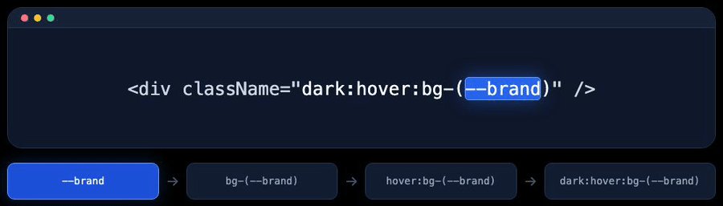

# Expand Class Name Selection


Adds useful inner-to-outer selection ranges for utility class names to VS
Code's existing **Expand Selection** and **Shrink Selection** hierarchy.



Place the cursor anywhere inside a class. Repeatedly run **Expand Selection**
to move outward through the meaningful pieces of that class:

```tsx
<div className="dark:hover:bg-(--brand)" />
                  │
                  ▼
--brand
→ bg-(--brand)
→ hover:bg-(--brand)
→ dark:hover:bg-(--brand)
→ the complete class token
→ larger syntax ranges
```

This improves the default VS Code behavior by exposing the nested structure
inside a class token before jumping to the whole class string.

## What expands

The provider builds the smallest useful range first, then expands outward.

- Tailwind variants: `gray-50` → `bg-gray-50` → `hover:bg-gray-50`
- Arbitrary values: `16px` → `h-[16px]`
- CSS-variable shorthand: `--space-xs` → `gap-(--space-xs)`
- Nested variants: `bg-gray-50` → `hover:bg-gray-50` → `dark:hover:bg-gray-50`

For a normal class list, the final contributed range is the complete class
token. VS Code then continues with its usual syntax-level ranges.

## Supported attributes

- `class`
- `className`

Double-quoted, single-quoted, and template-literal values are supported.

## Class functions

Strings nested in these function calls are supported by default:

- `cn`
- `clsx`
- `cva`
- `classNames`
- `twMerge`

Add or replace function names with the `expandClassNameSelection.classFunctions`
setting:

```json
{
  "expandClassNameSelection.classFunctions": ["cn", "styles"]
}
```

## Supported language modes

All language modes are supported. The provider contributes a range only when
the cursor is in a quoted `class` or `className` value, or in a configured
class-function string.

The extension contributes selection ranges only. It does not add commands or
keybindings.
